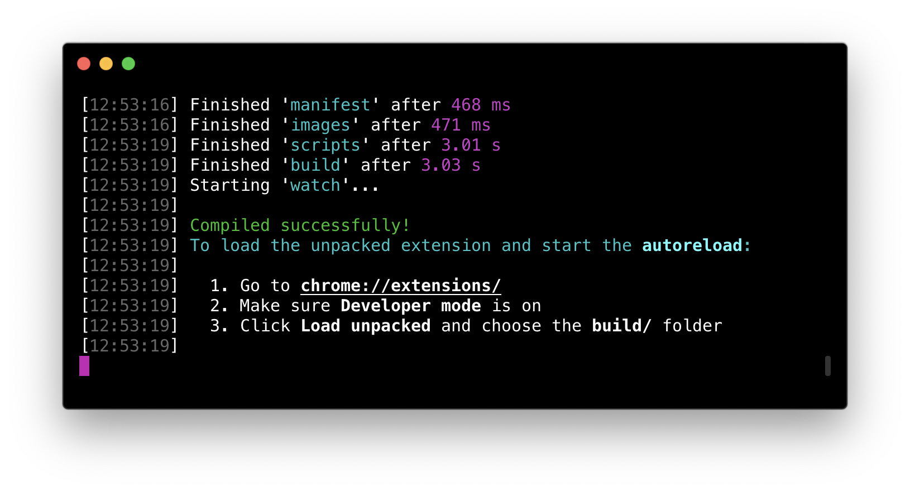
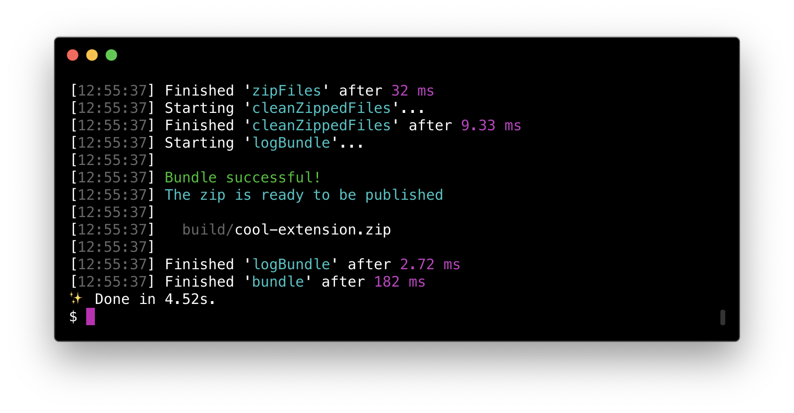

# browser-modern-extension-boilerplate

> Boilerplate for creating a browser extension with up-to-date tools and autoreload of the extension

## Features

This project is born because of the lack of browser extension starter kits which aren't from 2013 and don't use bower.

[Gulp 4](https://github.com/gulpjs/gulp) is used to manage all the tasks and wire the tools together, it was chosen because it's easily hackable and configurable, you can make it fit and scale with your wildest browser extension!

It uses [webpack](https://webpack.js.org/) to bundle javascript and [SCSS](http://sass-lang.com/) as a preprocessor. [Babel](http://babeljs.io/) transpiles all the future js stuff that hasn't landed in chrome yet, and there are customizable [eslint](https://eslint.org/) and [stylelint](https://stylelint.io/) config files.

The development mode has **autoreload** of the chrome extension, meaning that when you change a file, the extension is loaded again in chrome! 🔥

It comes with the [webextension-polyfill](https://github.com/mozilla/webextension-polyfill), which basically lets you write **async/await code** instead of the callback hell of the chrome extension apis. 💣

It also bundles your extension when you're done, ready to be pusblished to the extension store!

## Getting started

The easiest way is to use the [Yeoman generator](https://github.com/marcofugaro/generator-browser-modern-extension), you get to configure more stuff that way, here is a demo:

Alternatively, click the [Use this template](https://github.com/marcofugaro/browser-modern-extension-boilerplate/generate) button here on github, it will create a repo containing these files.

Otherwise you can just `git clone` or [download](https://github.com/marcofugaro/browser-modern-extension-boilerplate/archive/master.zip) this repo and get the contents of the `boilerplate` folder.

After you downloaded the files, create the .env file by running `cp .env.example .env`. Then replace all the occurrences of `<%= title %>`, `<%= kebabTitle %>` and so on.

## Install

#### [Chrome extension]()
#### [Firefox add-on]()

## Development

- `yarn start` to compile and watch the files for changes.

  To enable the autoreload on chrome:

  1. Go to `chrome://extensions/`
  1. Make sure **Developer mode** is on
  1. Click **Load unpacked** and choose the **build/** folder

  Instead, if you want to develop on firefox, check out [web-ext](https://github.com/mozilla/web-ext).

- `yarn build` to just compile the files.
- `yarn bundle` to compile the files and put them in a `.zip`, ready to be published.